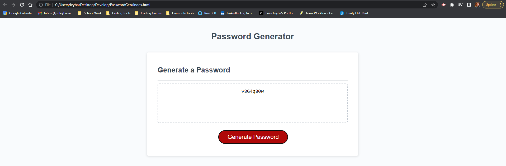

# Password-Generator

## Description

Modify a starter code to create an application that enables employees to generate random passwords based on criteria that they’ve selected. It will have a clean and polished, responsive user interface that adapts to multiple screen sizes.

## Instructions

I click the button to generate a password- I am presented with a series of prompts for password criteria

When prompted for password criteria- I select which criteria to include in the password

When prompted for the length of the password- I choose a length of at least 8 characters and no more than 128 characters

When asked for character types to include in the password- I confirm whether or not to include lowercase, uppercase, numeric, and/or special characters

When I answer each prompt- my input should be validated and at least one character type should be selected

When all prompts are answered- a password is generated that matches the selected criteria

When the password is generated- the password is either displayed in an alert or written to the page

## Requirements

Satisfies all of the preceding acceptance criteria plus the following code improvements:

Application user experience is intuitive and easy to navigate.

Application resembles the mock-up functionality provided in the Challenge instructions.

Application deployed at live URL.

Application loads with no errors.

## Notes

[Live link](https://leybaair.github.io/Password-Generator/)

Image Screen Shot: 
